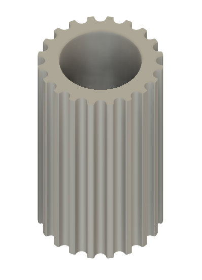
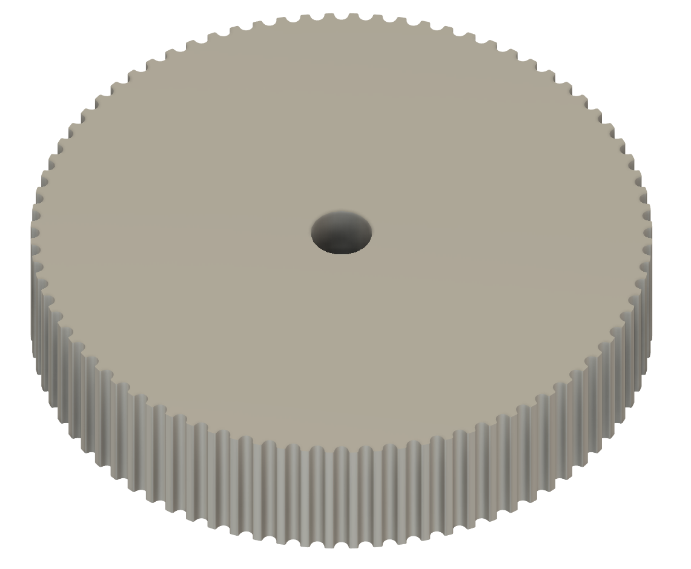
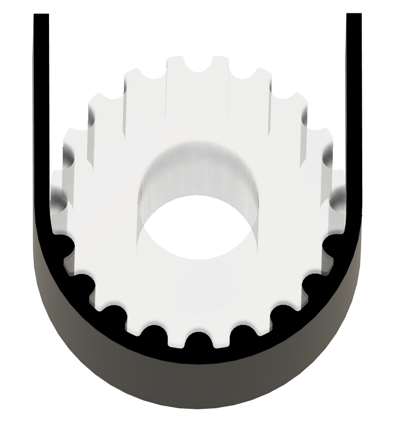

# Gates Pulley Creator

## Information
Generates a 2GT pulley based on Gates spec. Use Fusion parameters to change the # of teeth, bore diameter, and pulley length.

Note the pulley does not include a hub nor flanges.

  
  
  

